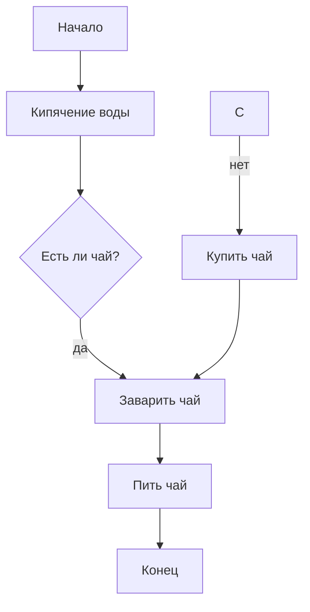
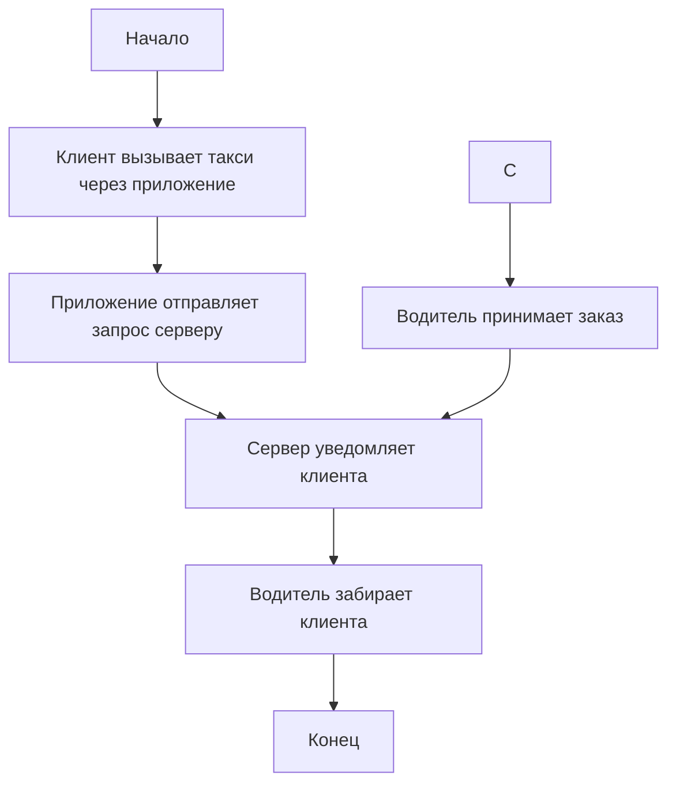
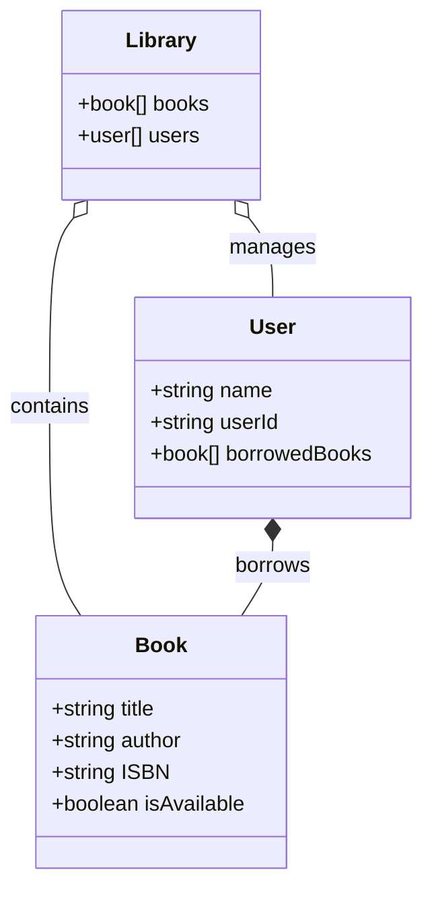
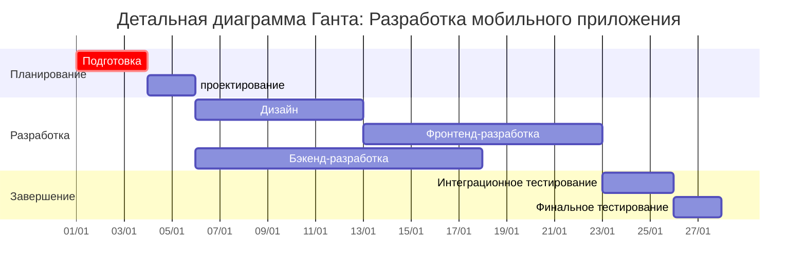
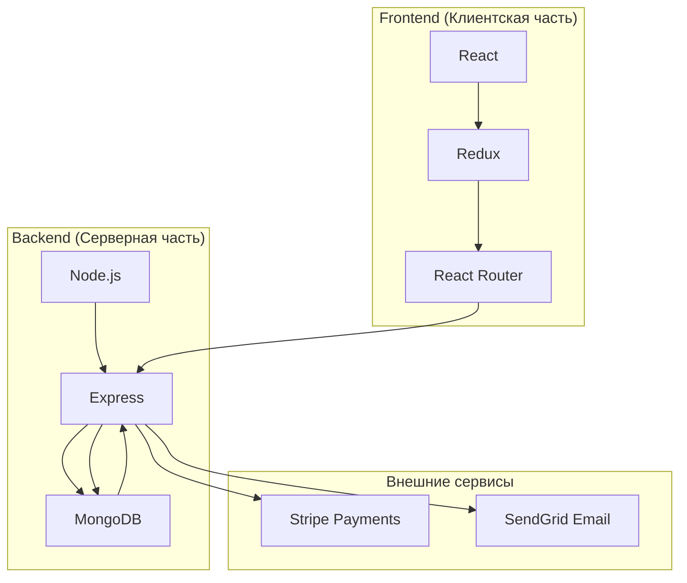
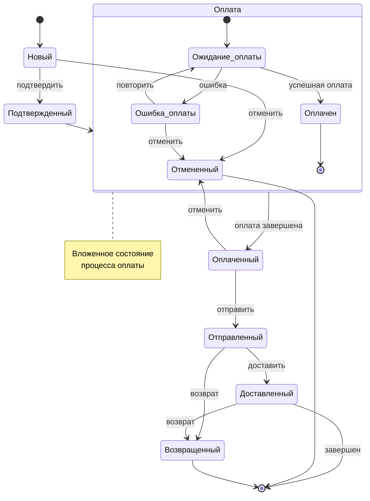
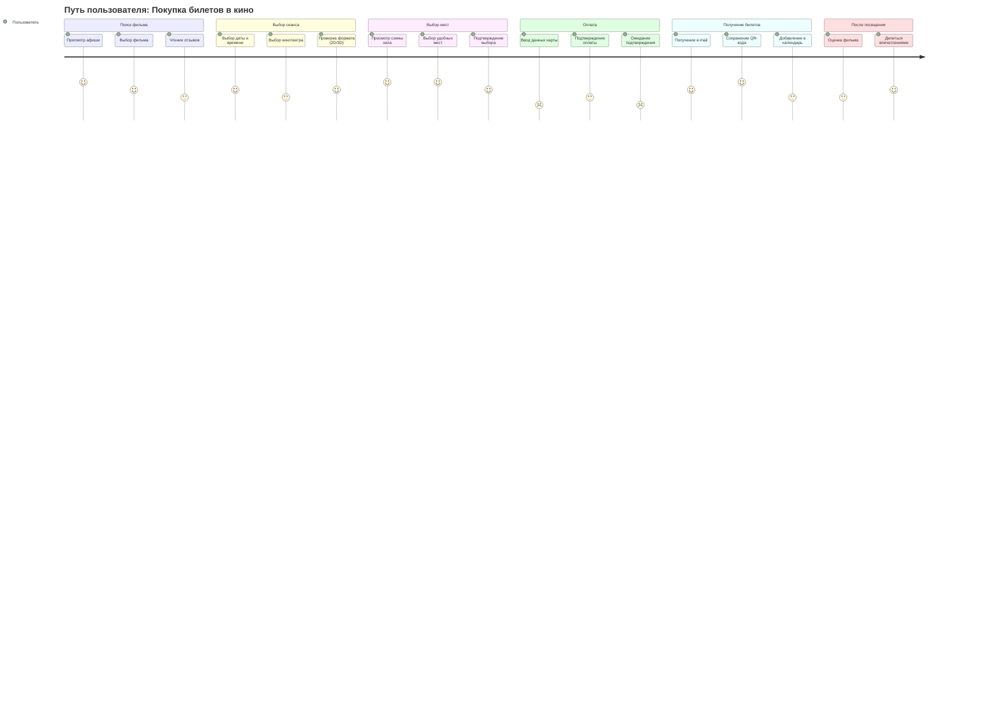
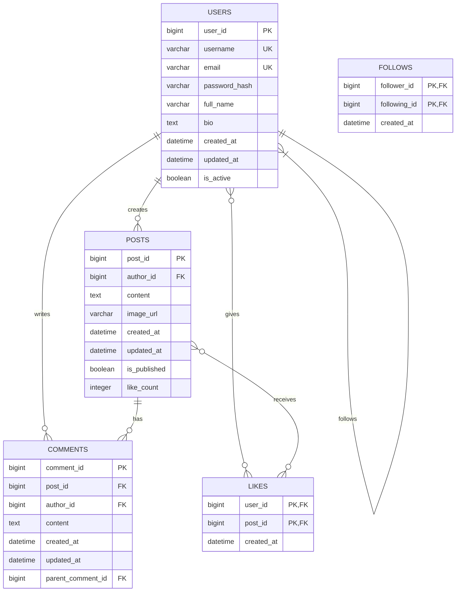
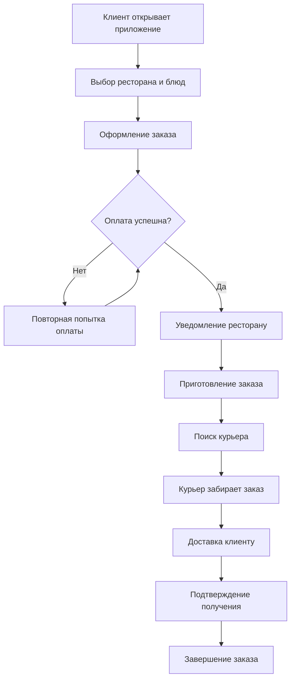
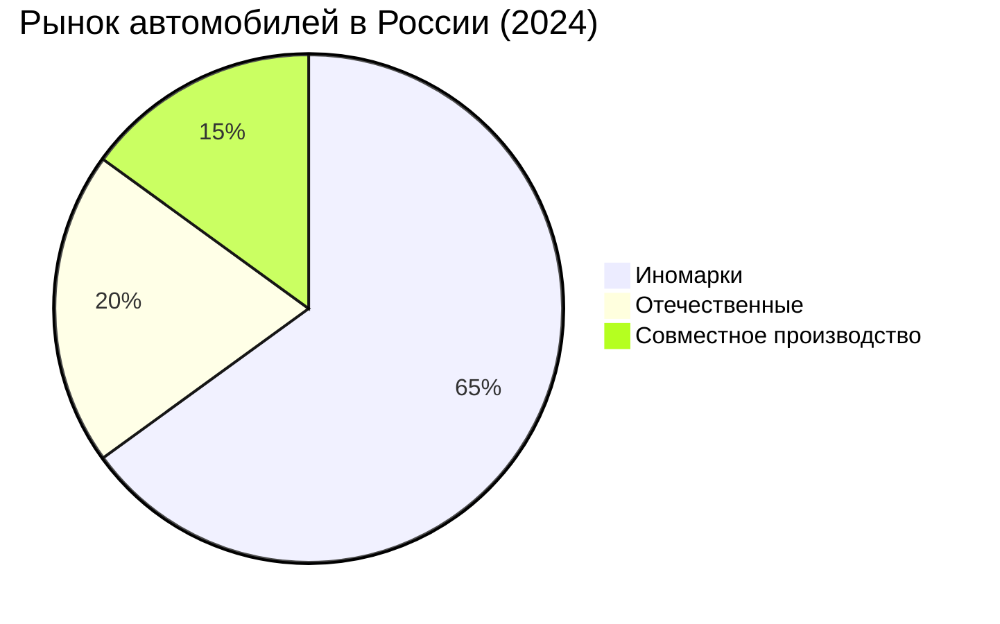

# tea

```mermaid
flowchart TD
    A[Начало] --> B[Кипячение воды]
    B --> C{Есть ли чай?}
    C --> |да| D[Заварить чай]
    С --> |нет| E[Купить чай]
    E --> D
    D --> F[Пить чай]
    F --> G[Конец]
```
# taxi

```mermaid
flowchart TD
    A[Начало] --> B[Клиент вызывает такси через приложение]
    B --> C[Приложение отправляет запрос серверу]
    C --> D[Сервер ищет свободного водителя]
    С --> E[Водитель принимает заказ]
    E --> D[Сервер уведомляет клиента]
    D --> F[Водитель забирает клиента]
    F --> G[Конец]
```
# library

```mermaid
classDiagram
    class Library{
    +book[] books
    +user[] users
    }
     class Book {
        +string title
        +string author
        +string ISBN
        +boolean isAvailable
    }

    class User {
        +string name
        +string userId
        +book[] borrowedBooks
    }

    Library o-- Book : contains
    Library o-- User : manages
    User *-- Book : borrows
```
# plan

```mermaid
gantt
    title Детальная диаграмма Ганта: Разработка мобильного приложения
    dateFormat  YYYY-MM-DD
    axisFormat  %d/%m

    section Планирование
    Подготовка     :crit, prep1, 2024-01-01, 3d
    проектирование :prep2, after prep1, 2d

    section Разработка
    Дизайн       :design, after prep2, 7d
    Фронтенд-разработка      :frontend, after design, 10d
    Бэкенд-разработка        :backend, after prep2, 12d

    section Завершение
    Интеграционное тестирование :test1, after frontend, 3d
    Финальное тестирование      :test2, after test1, 2d
```
# Graf z

```mermaid
graph TB
    subgraph Frontend["Frontend (Клиентская часть)"]
        A[React]
        B[Redux]
        C[React Router]
        A --> B
        B --> C
    end

    subgraph Backend["Backend (Серверная часть)"]
        D[Node.js]
        E[Express]
        F[MongoDB]
        D --> E
        E --> F
    end

    subgraph ExternalServices["Внешние сервисы"]
        G[Stripe Payments]
        H[SendGrid Email]
    end

    %% Связи между компонентами
    C --> E
    E --> G
    E --> H
    E --> F
    F --> E
```
# Диаграмма состояний

```mermaid
stateDiagram-v2
    [*] --> Новый
    Новый --> Подтвержденный : подтвердить
    Новый --> Отмененный : отменить

    state Оплата {
        [*] --> Ожидание_оплаты
        Ожидание_оплаты --> Оплачен : успешная оплата
        Ожидание_оплаты --> Ошибка_оплаты : ошибка
        Ошибка_оплаты --> Ожидание_оплаты : повторить
        Ошибка_оплаты --> Отмененный : отменить
        Оплачен --> [*]
    }

    Подтвержденный --> Оплата
    Оплата --> Оплаченный : оплата завершена

    Оплаченный --> Отправленный : отправить
    Оплаченный --> Отмененный : отменить

    Отправленный --> Доставленный : доставить
    Отправленный --> Возвращенный : возврат

    Доставленный --> Возвращенный : возврат
    Доставленный --> [*] : завершен

    Отмененный --> [*]
    Возвращенный --> [*]

    note right of Оплата
      Вложенное состояние
      процесса оплаты
    end note
```
# ticket

```mermaid
journey
    title Путь пользователя: Покупка билетов в кино
    section Поиск фильма
      Просмотр афиши: 5: Пользователь
      Выбор фильма: 4: Пользователь
      Чтение отзывов: 3: Пользователь
    section Выбор сеанса
      Выбор даты и времени: 4: Пользователь
      Выбор кинотеатра: 3: Пользователь
      Проверка формата (2D/3D): 4: Пользователь
    section Выбор мест
      Просмотр схемы зала: 5: Пользователь
      Выбор удобных мест: 5: Пользователь
      Подтверждение выбора: 4: Пользователь
    section Оплата
      Ввод данных карты: 2: Пользователь
      Подтверждение оплаты: 3: Пользователь
      Ожидание подтверждения: 2: Пользователь
    section Получение билетов
      Получение e-mail: 4: Пользователь
      Сохранение QR-кода: 5: Пользователь
      Добавление в календарь: 3: Пользователь
    section После посещения
      Оценка фильма: 3: Пользователь
      Делиться впечатлениями: 4: Пользователь
```
# ER

```mermaid
erDiagram
    USERS {
        bigint user_id PK
        varchar username UK
        varchar email UK
        varchar password_hash
        varchar full_name
        text bio
        datetime created_at
        datetime updated_at
        boolean is_active
    }

    POSTS {
        bigint post_id PK
        bigint author_id FK
        text content
        varchar image_url
        datetime created_at
        datetime updated_at
        boolean is_published
        integer like_count
    }

    COMMENTS {
        bigint comment_id PK
        bigint post_id FK
        bigint author_id FK
        text content
        datetime created_at
        datetime updated_at
        bigint parent_comment_id FK
    }

    LIKES {
        bigint user_id PK,FK
        bigint post_id PK,FK
        datetime created_at
    }

    FOLLOWS {
        bigint follower_id PK,FK
        bigint following_id PK,FK
        datetime created_at
    }

    %% Relationships
    USERS ||--o{ POSTS : "creates"
    USERS ||--o{ COMMENTS : "writes"
    POSTS ||--o{ COMMENTS : "has"
    USERS }o--o{ LIKES : "gives"
    POSTS }o--o{ LIKES : "receives"
    USERS }|--|| USERS : "follows"
```
# delivery

```mermaid
flowchart TD
    A[Клиент открывает приложение] --> B[Выбор ресторана и блюд]
    B --> C[Оформление заказа]
    C --> D{Оплата успешна?}
    D -->|Нет| E[Повторная попытка оплаты]
    E --> D
    D -->|Да| F[Уведомление ресторану]
    F --> G[Приготовление заказа]
    G --> H[Поиск курьера]
    H --> I[Курьер забирает заказ]
    I --> J[Доставка клиенту]
    J --> K[Подтверждение получения]
    K --> L[Завершение заказа]
```
# Диаграмма

```mermaid
pie title Рынок автомобилей в России (2024)
    "Иномарки" : 65
    "Отечественные" : 20
    "Совместное производство" : 15
```